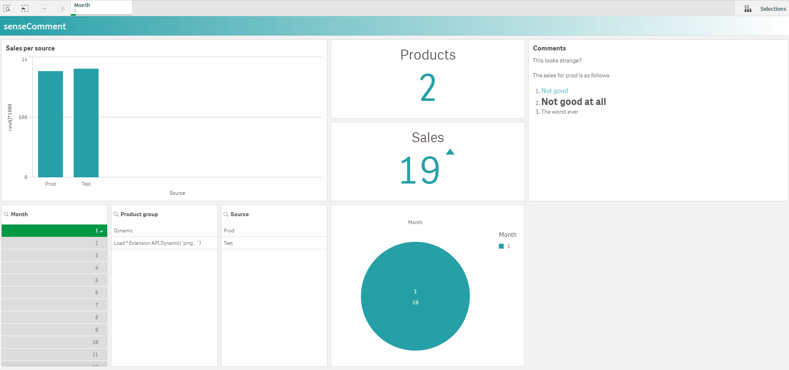
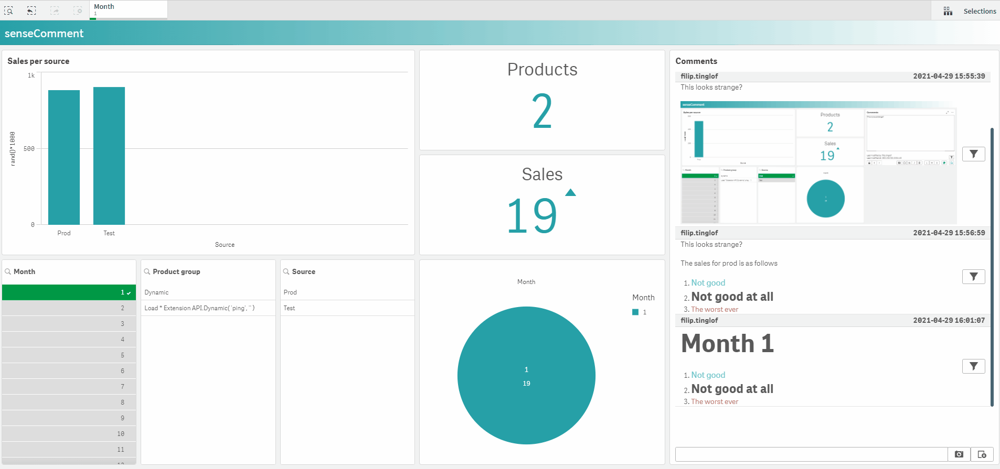

# senseComment

# Description
SenseComment enable you to make rich notes and comments directly within the application.
Comments are stored on the sense server.

# Functions
The comments are stored outside the application on the qlik sense server
Comments can be connected to specific selections or section access
You can embed a print screen into the comment or just extract the fint screen to a seperate tab for later use (powerpoint)
The comments are autorefreshed so you can view live commenting/chatting
Comments can be styled according to the active qlik theme
All history is saved, hence you can always go back and see the previous comment/chat

